<!-- Bugs                                                                                                                                         -->
<!-- ------                                                                                                                                       -->
<!-- stone cloak makes ascii walls vanish                                                                                                         -->
<!-- ------                                                                                                                                       -->
<!--                                                                                                                                              -->
<!-- Performance                                                                                                                                  -->
<!-- ------                                                                                                                                       -->
<!-- sudo operf ./zorbash-game --playername discobob --seed victimlake --nodebug --quick-start                                                    -->
<!-- opreport  --demangle=smart --symbols| less                                                                                                   -->
<!-- ------                                                                                                                                       -->
<!--                                                                                                                                              -->
<!-- Accessibility                                                                                                                                -->
<!-- ------                                                                                                                                       -->
<!-- keyboard only mode                                                                                                                           -->
<!-- keyboard only mode single hand i.e. no key combinations                                                                                      -->
<!-- ------                                                                                                                                       -->
<!--                                                                                                                                              -->
<!-- MVP plan                                                                                                                                     -->
<!-- ------                                                                                                                                       -->
<!-- - monsters with random buffs like vampirism would be interesting                                                                             -->
<!-- - boiling steam over water when fireball passes                                                                                              -->
<!-- - dog pack / howling ?                                                                                                                       -->
<!-- - freeze slimes                                                                                                                              -->
<!-- - recharge wands based on enchant                                                                                                            -->
<!-- - crystal key                                                                                                                                -->
<!-- - negation                                                                                                                                   -->
<!-- - golems killed by negation                                                                                                                  -->
<!-- - vampiric damage                                                                                                                            -->
<!-- - This scroll contains a powerful anti-magic. When it is released, all creatures (including yourself) and all items lying on the ground      -->
<!-- - within your field of view will be exposed to its blast and stripped of magic  - and creatures animated purely by magic will die. Potions,  -->
<!-- - scrolls, items being held by other creatures and items in your inventory will not be affected.                                             -->
<!-- - chaos bell of summoning                                                                                                                    -->
<!-- - crystal chest needs crystal key                                                                                                            -->
<!-- - teleport block                                                                                                                             -->
<!-- - invisibility wand / and crystals walls (or chest) that reflect, so can use on yourself or ally                                             -->
<!-- - slime can grow into megaslime if satiated                                                                                                  -->
<!-- - bloat                                                                                                                                      -->
<!-- - cloak of jelly                                                                                                                             -->
<!-- - need allies                                                                                                                                -->
<!-- - potion of paralysis                                                                                                                        -->
<!-- - cursed weapon with bad luck / horseshoe / witches hat?                                                                                     -->
<!-- - luck trap                                                                                                                                  -->
<!-- - luck and enchanted stuff                                                                                                                   -->
<!-- - runics on weapons, like vampirism, force, quietus, lightning                                                                               -->
<!-- - swamp                                                                                                                                      -->
<!-- - swamp wort food                                                                                                                            -->
<!-- - ogre and totems?                                                                                                                           -->
<!-- - swamp level                                                                                                                                -->
<!-- - boss 1 Mummy mummy, ankh of life                                                                                                           -->
<!-- - boss 2 jelly boss, spawns jellys, tries to jump splat the player                                                                           -->
<!--          swamp wort, gas bloater and swamp tiles that allow 50% movement                                                                     -->
<!--          boss will eat swamp wort to spawn                                                                                                   -->
<!--          explode bog tiles to kill boss                                                                                                      -->
<!-- - boss 3 rat king boss, sewer like level with rats coming out of the walls                                                                   -->
<!-- - boss 4 goblin king boss, will be happy if the rat king crown is given                                                                      -->
<!-- - boss 5 water level, kraken? can grab and throw the player                                                                                  -->
<!-- - boss 6 ...                                                                                                                                 -->
<!-- - boss 7 face a clone of yourself                                                                                                            -->
<!-- - boss 8 Place crystals at the alter of Zorb. This opens a vault. Go inside and battle zorbash.                                              -->
<!-- -        If you win, the gods turn on you and you get to replaced Zorbash.                                                                   -->
<!-- -        You spare zorbash, he regenerates, you run out and destroy the alter and the demi gods, return to home.                             -->
<!-- -        The curse was that the alter of Zorb would grant demi god status to any that sacrificed one that was dear to them.                  -->
<!-- -        This curse must be renewed many times. Zorbash, -ash means servant of Zorb was such a team member who was sacrificed.               -->
<!-- -        The only way to break the curse is to destroy the crystals. Zorbash will then be freed from servitude.                              -->
<!-- - different sound for bosses                                                                                                                 -->
<!-- - crystal collection                                                                                                                         -->
<!-- - 4 bosses and final zorb boss                                                                                                               -->
<!-- - char selection                                                                                                                             -->
<!-- - level fall through to special level ?                                                                                                      -->
<!-- - hub shop levels                                                                                                                            -->
<!-- - basecamp level?                                                                                                                            -->
<!-- ------                                                                                                                                       -->
<!--                                                                                                                                              -->
<!-- UI                                                                                                                                           -->
<!-- ------                                                                                                                                       -->
<!-- - monst head should be on top of armor                                                                                                       -->
<!-- - rest until better                                                                                                                          -->
<!-- ------                                                                                                                                       -->
<!--                                                                                                                                              -->
<!-- Level                                                                                                                                        -->
<!-- ------                                                                                                                                       -->
<!-- - tomb of past player ? or random player ? leads to random small room?                                                                       -->
<!-- - gold needs to do something - shop? buy/sell                                                                                                -->
<!-- - totems are like mobs, but do not spawn except initially. The worshippers are imbued with power but do not die when the totem does.         -->
<!-- - exploding bogs                                                                                                                             -->
<!-- - vaults                                                                                                                                     -->
<!-- - teleports                                                                                                                                  -->
<!-- - portable hunger - teleports you to a room full of digestive juices                                                                         -->
<!-- - moving floor                                                                                                                               -->
<!-- - shove chocolate frog statue, get frog?                                                                                                     -->
<!-- ------                                                                                                                                       -->
<!--                                                                                                                                              -->
<!-- Traps                                                                                                                                        -->
<!-- ------                                                                                                                                       -->
<!-- - random floor trap                                                                                                                          -->
<!-- - moving blocks?                                                                                                                             -->
<!-- ------                                                                                                                                       -->
<!--                                                                                                                                              -->
<!-- Sound                                                                                                                                        -->
<!-- ------                                                                                                                                       -->
<!-- - falling noise                                                                                                                              -->
<!-- - sword noises                                                                                                                               -->
<!-- ------                                                                                                                                       -->
<!--                                                                                                                                              -->
<!-- Skills                                                                                                                                       -->
<!-- ------                                                                                                                                       -->
<!-- - challenging learning spot to acquire skills?                                                                                               -->
<!-- - skills                                                                                                                                     -->
<!-- - skill, dodge                                                                                                                               -->
<!-- - skill, instakill, once per level                                                                                                           -->
<!-- - skill, heroic charge, rush enemy                                                                                                           -->
<!-- - skill, guaranteed hit, but you have no defense in the next move                                                                            -->
<!-- - skill, whirl attack, attack 2 or 3 enemies                                                                                                 -->
<!-- - skill, healing                                                                                                                             -->
<!-- - skill, defensive mode, recover stamina                                                                                                     -->
<!-- - skill, kneecap, hobble enemy                                                                                                               -->
<!-- - skill, switch to defensive                                                                                                                 -->
<!-- - skill, blind strike, attack the eyes                                                                                                       -->
<!-- - skill, slash and roll                                                                                                                      -->
<!-- - skill, slash and jump                                                                                                                      -->
<!-- - skill, spring attack, give up a round for 2.5 times damage                                                                                 -->
<!-- ------                                                                                                                                       -->
<!--                                                                                                                                              -->
<!-- Poison                                                                                                                                       -->
<!-- ------                                                                                                                                       -->
<!-- - chocolote frog cures poison?                                                                                                               -->
<!-- ------                                                                                                                                       -->
<!--                                                                                                                                              -->
<!-- Gasses                                                                                                                                       -->
<!-- ------                                                                                                                                       -->
<!-- - gasses that spread however you will need to allow levels with gas or fire to tick so it can dissipate                                      -->
<!-- ------                                                                                                                                       -->
<!--                                                                                                                                              -->
<!-- Doors                                                                                                                                        -->
<!-- ------                                                                                                                                       -->
<!-- - hit door, summon monst chance                                                                                                              -->
<!-- - hit door, wake sleeping monsters                                                                                                           -->
<!-- ------                                                                                                                                       -->
<!--                                                                                                                                              -->
<!-- AI                                                                                                                                           -->
<!-- ------                                                                                                                                       -->
<!-- - eat corpses, like a bat corpse?                                                                                                            -->
<!-- - add monst states, like wandering (not noticed your stealth), hunting, worshipping, sleeping                                                -->
<!-- ------                                                                                                                                       -->
<!--                                                                                                                                              -->
<!-- Rings                                                                                                                                        -->
<!-- ------                                                                                                                                       -->
<!-- - necro protection ring                                                                                                                      -->
<!-- - ring combos?                                                                                                                               -->
<!-- ------                                                                                                                                       -->
<!--                                                                                                                                              -->
<!-- Wands                                                                                                                                        -->
<!-- ------                                                                                                                                       -->
<!-- - staves that recharge                                                                                                                       -->
<!-- - wand of death should stop regenerating monst                                                                                               -->
<!-- ------                                                                                                                                       -->
<!--                                                                                                                                              -->
<!-- Potions                                                                                                                                      -->
<!-- ------                                                                                                                                       -->
<!-- - have a monster use a potion?                                                                                                               -->
<!-- - antipoison potion                                                                                                                          -->
<!-- - enchant potion of descent radius                                                                                                           -->
<!-- ------                                                                                                                                       -->
<!--                                                                                                                                              -->
<!-- Armor                                                                                                                                        -->
<!-- ------                                                                                                                                       -->
<!-- - dragon scale mail for fire proofing                                                                                                        -->
<!-- ------                                                                                                                                       -->
<!--                                                                                                                                              -->
<!-- Weapons                                                                                                                                      -->
<!-- ------                                                                                                                                       -->
<!-- - holy water cures poison                                                                                                                    -->
<!-- - darts / poison darts                                                                                                                       -->
<!-- - strength penalties                                                                                                                         -->
<!-- - blessed items resist explosion                                                                                                             -->
<!-- - warhammer should kill parent jelly in one go                                                                                               -->
<!-- - warhammer smash skeletton                                                                                                                  -->
<!-- - (blunt/warhamma?) slime specific weapon does not cause slimes to split                                                                     -->
<!-- ------                                                                                                                                       -->
<!--                                                                                                                                              -->
<!-- Water                                                                                                                                        -->
<!-- ------                                                                                                                                       -->
<!-- - water, kraken, eels; kraken will move out of shallows                                                                                      -->
<!-- - make ripples, summon monsters                                                                                                              -->
<!-- ------                                                                                                                                       -->
<!--                                                                                                                                              -->
<!-- Monsts                                                                                                                                       -->
<!-- ------                                                                                                                                       -->
<!-- - ogres and ogre totem                                                                                                                       -->
<!-- - chickens - battle chickens - lay eggs as food - and they get names                                                                         -->
<!-- - acid jellies should damage weapons                                                                                                         -->
<!-- - spider that throws web?                                                                                                                    -->
<!-- - grass death wakes monsters                                                                                                                 -->
<!-- - mold growth / floor puddings                                                                                                               -->
<!-- - bloodgrass, grows near corpses                                                                                                             -->
<!-- - yak that eats foilage                                                                                                                      -->
<!-- - shove/lure monsters into webs?                                                                                                             -->
<!-- - rat pack and king rat / cranium rat                                                                                                        -->
<!-- - zombie camel?                                                                                                                              -->
<!-- - new monst? should explode in fire?                                                                                                         -->
<!-- - sewer wolf?                                                                                                                                -->
<!-- - invisible monst?                                                                                                                           -->
<!-- - monster that runs from light ?                                                                                                             -->
<!-- - tentacles out of the ground that try to surround you                                                                                       -->
<!-- - creature that pretends to be a stone until close by then sprouts legs                                                                      -->
<!-- - dungeon walrus; long headed walrus with many tusks                                                                                         -->
<!-- - gloat - cube like creature that explodes on touch and then its spirit gloats over your death                                               -->
<!-- ------                                                                                                                                       -->
<!--                                                                                                                                              -->
<!-- Gods                                                                                                                                         -->
<!-- ------                                                                                                                                       -->
<!-- - runes lean more torwards old gods                                                                                                          -->
<!-- ------                                                                                                                                       -->
<!--                                                                                                                                              -->
<!-- Gfx                                                                                                                                          -->
<!-- ------                                                                                                                                       -->
<!-- - tiny pixel effects that bounce?                                                                                                            -->
<!-- ------                                                                                                                                       -->
<!--                                                                                                                                              -->
<!-- Player                                                                                                                                       -->
<!-- ------                                                                                                                                       -->
<!-- - weight factors into jumping                                                                                                                -->
<!-- - carry eat slime mold and gain acid resis?                                                                                                  -->
<!-- ------                                                                                                                                       -->
<!--                                                                                                                                              -->
<!-- Spells                                                                                                                                       -->
<!-- ------                                                                                                                                       -->
<!-- - spell capacitor                                                                                                                            -->
<!-- - spell chaining                                                                                                                             -->
<!-- ------                                                                                                                                       -->
<!--                                                                                                                                              -->

Zorbash
-------

Welcome to the lair of the dread tentacleye, Zorbash. Collect the crystals of Zorb and confront Zorbash to win.

This is work in progress. My plan is to release a minimal viable game this year; 2022. Likely linux
only with windows to follow later.

Comments and suggestions welcome.

Pixel art and ascii mode options
--------------------------------

Press <TAB> to switch between modes during the game.

<p align="center">
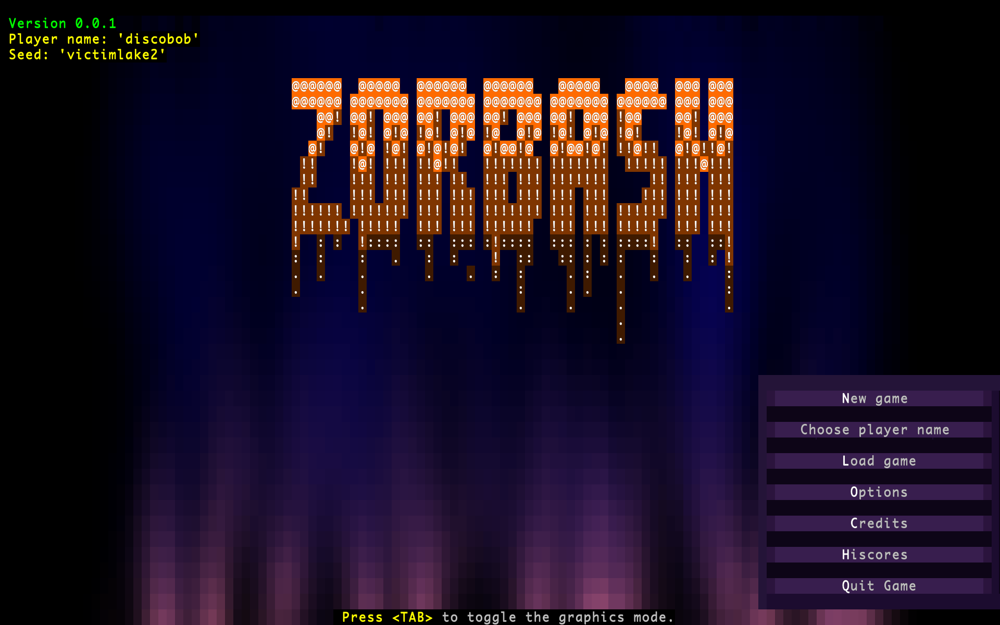
&nbsp; &nbsp; &nbsp; &nbsp;
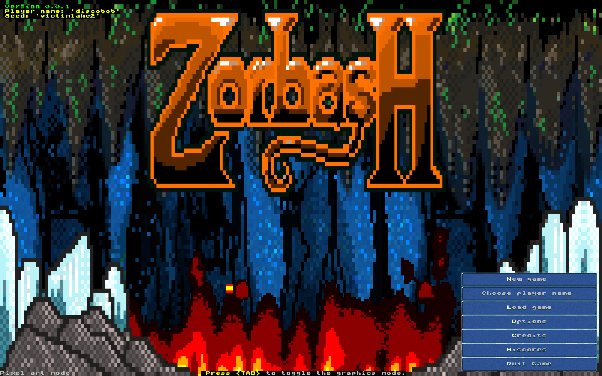
</p>

<p align="center">
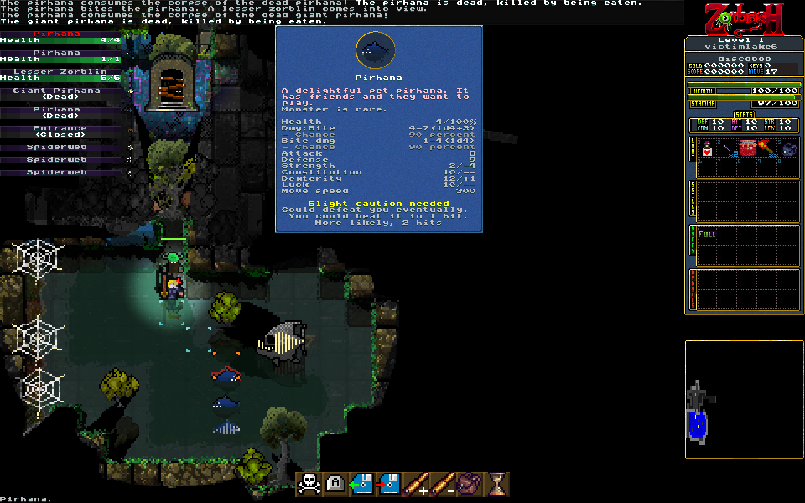
&nbsp; &nbsp; &nbsp; &nbsp;
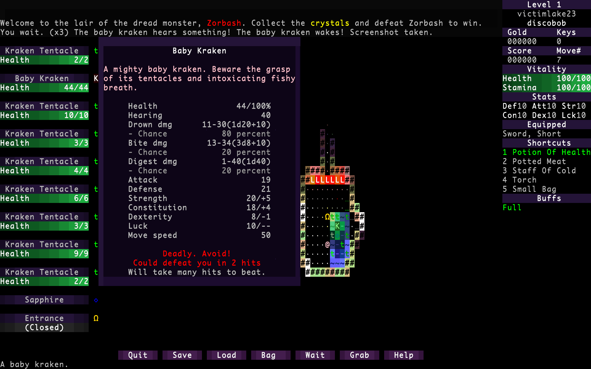
</p>

<p align="center">
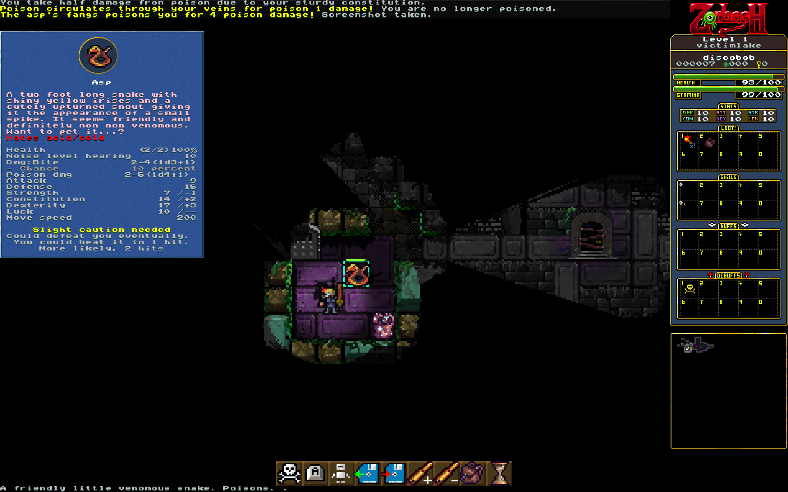
&nbsp; &nbsp; &nbsp; &nbsp;
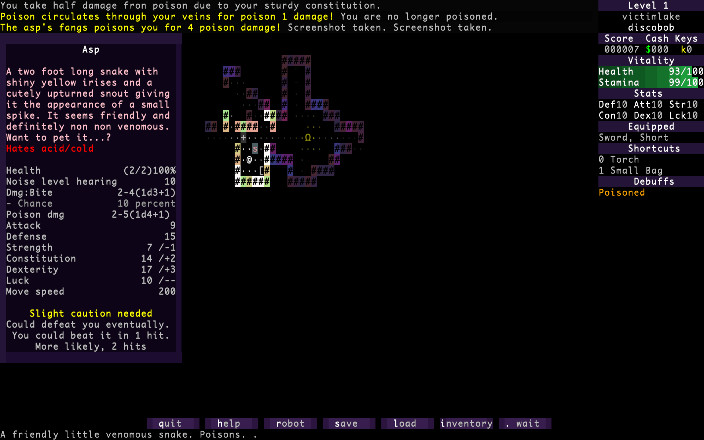
</p>

<p align="center">
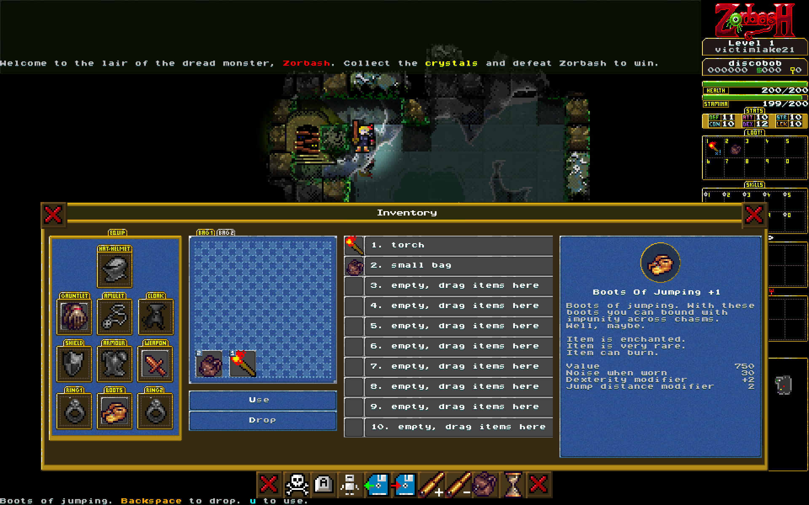
&nbsp; &nbsp; &nbsp; &nbsp;
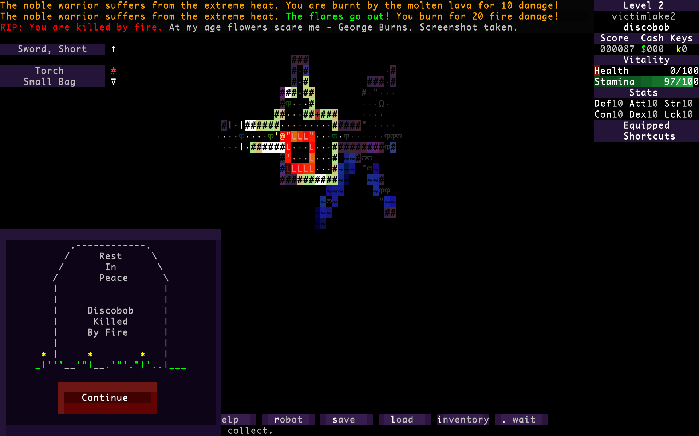
</p>

<p align="center">
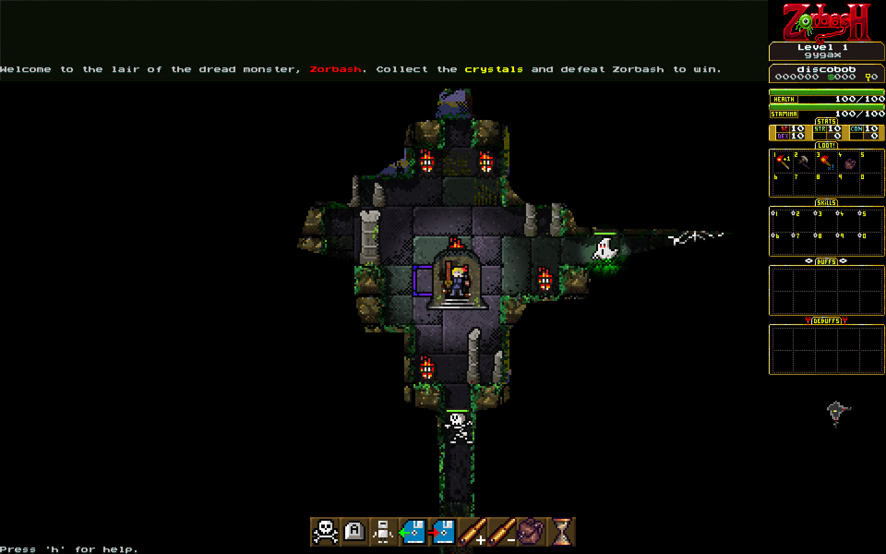
&nbsp; &nbsp; &nbsp; &nbsp;
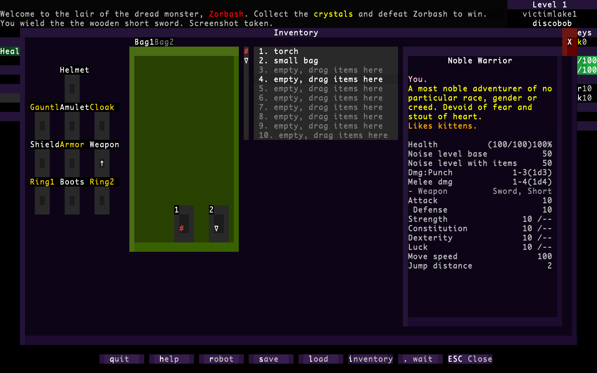
</p>

<p align="center">
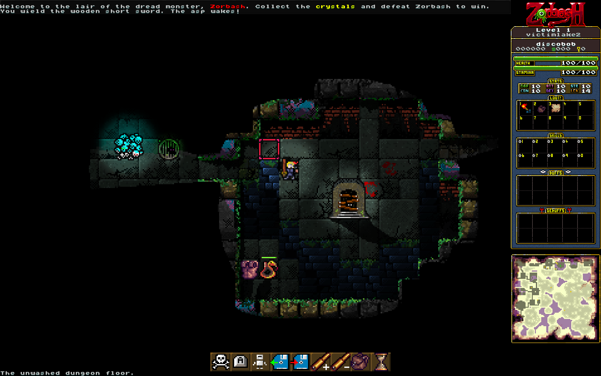
&nbsp; &nbsp; &nbsp; &nbsp;
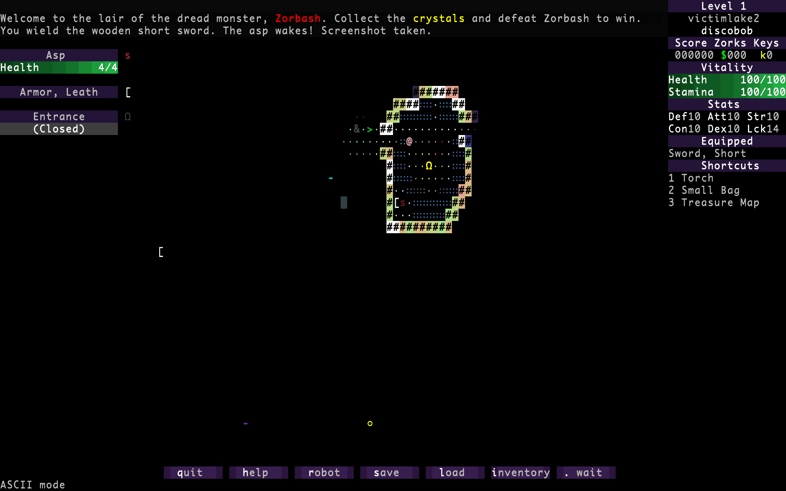
</p>

Ascii Screenshots
-----------------


Pixelart Screenshots
--------------------


How to build
------------

- On Linux: (Ubuntu 22.04)
<pre>
    sh ./RUNME
</pre>
- On MacOS (needs Mac Ports/Homebrew). Does not work with anaconda (help wanted):
<pre>
    sh ./RUNME
</pre>
- Docker (experimental, it builds but cannot find a video display):
<pre>
    sh ./RUNME.docker.ubuntu
    sh ./RUNME.docker.fedora
    sh ./RUNME.docker.debian
</pre>
- On Windows (todo)
<!-- - On Windows (todo): (install msys2 first via https://www.msys2.org/) -->
<!-- <pre>                                                                 -->
<!--     sh ./RUNME.windows.mingw64                                        -->
<!-- </pre>                                                                -->

If it doesn't build, just email goblinhack@gmail.com for help

Hardware Specs
--------------
The game should run fine on low end PCs, a half decent graphics card and
likely > 4g of RAM. If graphics is a limitation, you could run it in ascii
mode. I'd be interested in knowing of any low end specs that people get
this PC working on.

Dependancies
------------
OpenGL, SDL2 and Python3 is needed.

<!-- In days of old, The Zorbashian Empire discovered the Earth and they wrought much rage -->
<!-- upon her verdant soils. Their wrath was mighty and left the world scarred and in darkness. -->
<!--  -->
<!-- Those that remain, scavenge amongst the ruins of once great cities. Religious zealotry -->
<!-- has taken hold and all technology is viewed as demonic magic and forbidden. To be found -->
<!-- with Zorbashian tech is a death sentence. -->
<!--  -->
<!-- The planet is now a hellscape. Lava flows freely from the gushing wounds in the soil -->
<!-- and deserts grow larger every year. The animals have mutated into fearsome beasts and -->
<!-- the only safety is to be found in the undercities. -->
<!--  -->
<!-- Your task, nobel one, is only to survive, for in surviving we continue to resist. -->
<!-- If you are able to strike a blow against the Zorbashian demons then seek out their -->
<!-- many underground bases. It is from here they spawn from their far off realm. But -->
<!-- beware, they have many dread beasts guarding their bases. -->
<!--  -->
<!-- Legend says that there is a master base somewhere, where the Emperor Zorbash resides. -->
<!-- Whether this is true or not, cannot be said but to strike at the heart of their rule -->
<!-- may be enough to drive the Zorbashians out. And then we can be free again. -->
<!--  -->
<!--                       Hark! Hear now a tale untold -->
<!--                       since ancient times of yore -->
<!--                       of Zorbash, forgotten beast of old,  -->
<!--                       who dwelled deep near the Earth’s core -->
<!--                        -->
<!--                       ‘Twas from the Abyss he first arose, -->
<!--                       Forged treasures gold and gleaming.  -->
<!--                       A deadly lure to tempt all those -->
<!--                       Prone to greed and scheming -->
<!--                        -->
<!--                       Many fell before his throne,  -->
<!--                       Heroes fell asunder. -->
<!--                       His lightning gaze turned flesh to bone -->
<!--                       His roar was loud as thunder. -->
<!--                        -->
<!--                       Quenchless, thirsting, dripping gore -->
<!--                       His thousand eyes unmatched -->
<!--                       Until one tenacious band of four -->
<!--                       From him vict’ry snatched.  -->
<!--                        -->
<!--                       Although, ‘twas not an easy fight - -->
<!--                       A sacrifice was made. -->
<!--                       A volunteer, their faithful knight, -->
<!--                       Made sure the price was paid.  -->
<!--                        -->
<!--                       As godlings, the remaining three -->
<!--                       rose with fame and glory -->
<!--                       But that’s not yet the finale -->
<!--                       Of Zorbanadu’s dark story. -->
<!--                        -->
<!--                       For in the depths of Zorbash’s den,  -->
<!--                       A necromancer schemed. -->
<!--                       She planned to raise the beast again, -->
<!--                       And rule as his Dark Queen. -->
<!--                        -->
<!--                       So now Zorbash has come to life -  -->
<!--                       (Though ‘tis more like life’s dark shadow) -->
<!--                       With his fiersome undead wife -->
<!--                       Can you save us all, dear hero?  -->
<!--                        -->
<!--``` -->
<!--                       Secret Verses:                                         -->
<!--                       Twas not an easy fight, it’s true                      -->
<!--                       But not in the way you think.                          -->
<!--                       Our swords cut deep, drew blood_like goo               -->
<!--                       We fought in perfect sync.                             -->
<!--                                                                              -->
<!--                       But as we slashed, great Zorbash did                   -->
<!--                       Let loose an awful cry                                 -->
<!--                       For though blood streamed from each eyelid,            -->
<!--                       He could not seem to die.                              -->
<!--                                                                              -->
<!--                       We fought for days; the beast did roar                 -->
<!--                       And cry all the more miserably                         -->
<!--                       I found myself filled more and more                    -->
<!--                       with a surprising sympathy.                            -->
<!--                                                                              -->
<!--                       In my own house, I had much gold.                      -->
<!--                       A stash I’d saved away.                                -->
<!--                       How would I feel if someone strolled                   -->
<!--                       Into my house one day?                                 -->
<!--                                                                              -->
<!--                       ‘Twas after all, his residence                         -->
<!--                       We’d strolled into so boldly.                          -->
<!--                       He’d every right, after our offense,                   -->
<!--                       To try and kill us slowly                              -->
<!--                                                                              -->
<!--                       I shared my doubts with my dear friends,               -->
<!--                       And received an unhappy surprise                       -->
<!--                       “Betrayal!” they said. “Well, that debate’s at an end. -->
<!--                       You should be the one that dies!”                      -->
<!--                                                                              -->
<!--                       As it turns out, they’d already decided                -->
<!--                       To resort to the darkest extremes.                     -->
<!--                       My weakness, my pity had provided                      -->
<!--                       An excuse for our glorious team.                       -->

Graphics
--------
- Various items and monsters by Oryx, [found here](https://www.oryxdesignlab.com/)
- Various items and food by Henry Software, [found here](https://henrysoftware.itch.io)
<!-- Oryx: Order Number: #102084 (placed on January 16, 2016 03:14PM EST) -->

Music
-----
- Main music by the amazing Markus Heichelbech (deceased senior technician): [found here](http://nosoapradio.us)
<!-- and https://drive.google.com/drive/folders/0B_fD62tSeGaVRlBaZWJwS29JSnM -->

Sound effects
-------------
- 8 bit sounds by Oryx, [found here](https://www.oryxdesignlab.com/)
- Door sounds by TiesWijnen, [found here](https://freesound.org/people/TiesWijnen/)
- Door sounds by danielvj, [found here](https://freesound.org/people/danielvj/)
- Impact sounds by Adam N, [found here](https://freesound.org/people/egomassive/)
- Impact sounds by Deathscyp, [found here](https://freesound.org/people/Deathscyp/)
- Impact sounds by Dersuperanton, [found here](https://freesound.org/people/dersuperanton/)
- Impact sounds by RobinHood76, [found here](https://freesound.org/people/Robinhood76/)
- Slime sounds by Konstati, [found here](https://freesound.org/people/konstati/)
- Sword sounds by Danjocross, [found here](https://freesound.org/people/Danjocross/)
- Sword sounds by XxChr0nosxX, [found here](https://freesound.org/people/XxChr0nosxX/)
- Wood break sounds by Deathscyp, [found here](https://freesound.org/people/Deathscyp/)
- Footstep sounds by Rico Casazza, [found here](https://freesound.org/people/Rico_Casazza/)
- Rat growl sounds by qubodup, [found here](https://freesound.org/people/qubodup/)
- Rat hiss sounds by qubodup, [found here](https://freesound.org/people/qubodup/)
- Rat squeak sounds by tim.kahn, [found here](https://freesound.org/people/tim.kahn/)
- Grunt squeak sounds by vmgraw, [found here](https://freesound.org/people/vmgraw/)
- Monster death sounds by Michel88, [found here](https://freesound.org/people/Michel88/)
- Water splash sounds by launemax, [found here](https://freesound.org/people/launemax/)
- Bone sounds by ChrisReierson, [found here](https://freesound.org/people/ChrisReierson/)
