<!-- Bugs                                                                                                                                         -->
<!-- ------                                                                                                                                       -->
<!-- - spell of beckoning/repulsing                                                                                                               -->
<!-- - ogre totems?                                                                                                                               -->
<!-- - invisible phantoms that leave puddles of ectoplasm ?                                                                                       -->
<!-- - need any gas type                                                                                                                          -->
<!-- ------                                                                                                                                       -->
<!--                                                                                                                                              -->
<!-- Performance                                                                                                                                  -->
<!-- ------                                                                                                                                       -->
<!-- sudo operf ./zorbash --playername discobob --seed victimlake --nodebug --test-start                                                          -->
<!-- opreport  --demangle=smart --symbols| less                                                                                                   -->
<!-- ------                                                                                                                                       -->
<!--                                                                                                                                              -->
<!-- Skills                                                                                                                                       -->
<!-- ------                                                                                                                                       -->
<!-- - skill, instakill, once per level                                                                                                           -->
<!-- - skill, heroic charge, rush enemy                                                                                                           -->
<!-- - skill, guaranteed hit, but you have no defense in the next move                                                                            -->
<!-- - skill, whirl attack, attack 2 or 3 enemies                                                                                                 -->
<!-- - skill, kneecap, hobble enemy                                                                                                               -->
<!-- - skill, blind strike, attack the eyes                                                                                                       -->
<!-- - skill, slash and roll                                                                                                                      -->
<!-- - skill, slash and jump                                                                                                                      -->
<!-- - skill, spring attack, give up a round for 2.5 times damage                                                                                 -->
<!-- ------                                                                                                                                       -->
<!--                                                                                                                                              -->
<!-- MVP plan                                                                                                                                     -->
<!-- ------                                                                                                                                       -->
<!-- - mace/hammer - but next move penalty and strength penalties and pushes victim back one tile                                                 -->
<!-- - stealth                                                                                                                                    -->
<!-- - cracked walls                                                                                                                              -->
<!-- - cloak of slime                                                                                                                             -->
<!-- - sword of slime                                                                                                                             -->
<!-- - spider web spawn small spiders?                                                                                                            -->
<!-- - monsters with random buffs like vampirism would be interesting                                                                             -->
<!-- - crystals walls (or chest) that reflect, so can use on yourself or ally                                                                     -->
<!-- - cursed weapon with bad luck                                                                                                                -->
<!-- - luck trap                                                                                                                                  -->
<!-- - runics on weapons, like vampirism, force, quietus, lightning                                                                               -->
<!-- - boss 1 Mummy mummy, ankh of life                                                                                                           -->
<!-- - boss 2 slime boss, spawns slimes, tries to jump splat the player                                                                           -->
<!--          swamp tiles that allow 50% movement                                                                                                 -->
<!--          explode bog tiles to kill boss                                                                                                      -->
<!-- - boss 3 rat king boss, sewer like level with rats coming out of the walls                                                                   -->
<!-- - boss 4 goblin king boss, will be happy if the rat king crown is given                                                                      -->
<!-- - boss 5 water level, kraken?                                                                                                                -->
<!-- - boss 6 ...                                                                                                                                 -->
<!-- - boss 7 face a clone of yourself                                                                                                            -->
<!-- - boss 8 Place crystals at the alter of Zorb. This opens a vault. Go inside and battle zorbash.                                              -->
<!-- -        If you win, the gods turn on you and you get to replaced Zorbash.                                                                   -->
<!-- -        You spare zorbash, he regenerates, you run out and destroy the alter and the demi gods, return to home.                             -->
<!-- -        The curse was that the alter of Zorb would grant demi god status to any that sacrificed one that was dear to them.                  -->
<!-- -        This curse must be renewed many times. Zorbash, -ash means servant of Zorb was such a team member who was sacrificed.               -->
<!-- -        The only way to break the curse is to destroy the crystals. Zorbash will then be freed from servitude.                              -->
<!-- - different sound for bosses                                                                                                                 -->
<!-- - 4 bosses and final zorb boss                                                                                                               -->
<!-- - level fall through to special level ?                                                                                                      -->
<!-- - hub shop levels                                                                                                                            -->
<!-- - basecamp level?                                                                                                                            -->
<!-- ------                                                                                                                                       -->
<!--                                                                                                                                              -->
<!-- UI                                                                                                                                           -->
<!-- ------                                                                                                                                       -->
<!-- - rest until better                                                                                                                          -->
<!-- - auto explore                                                                                                                               -->
<!-- ------                                                                                                                                       -->
<!--                                                                                                                                              -->
<!-- Level                                                                                                                                        -->
<!-- ------                                                                                                                                       -->
<!-- - tomb of past player ? or random player ? leads to random small room?                                                                       -->
<!-- - vaults                                                                                                                                     -->
<!-- - portable hunger - teleports you to a room full of digestive juices                                                                         -->
<!-- - moving floor                                                                                                                               -->
<!-- - shove chocolate frog statue, get frog?                                                                                                     -->
<!-- ------                                                                                                                                       -->
<!--                                                                                                                                              -->
<!-- Traps                                                                                                                                        -->
<!-- ------                                                                                                                                       -->
<!-- - moving blocks?                                                                                                                             -->
<!-- ------                                                                                                                                       -->
<!--                                                                                                                                              -->
<!-- Poison                                                                                                                                       -->
<!-- ------                                                                                                                                       -->
<!-- - chocolate frog cures poison?                                                                                                               -->
<!-- ------                                                                                                                                       -->
<!--                                                                                                                                              -->
<!-- Doors                                                                                                                                        -->
<!-- ------                                                                                                                                       -->
<!-- - hit door, summon monst chance                                                                                                              -->
<!-- ------                                                                                                                                       -->
<!--                                                                                                                                              -->
<!-- AI                                                                                                                                           -->
<!-- ------                                                                                                                                       -->
<!-- - eat corpses, like a bat corpse?                                                                                                            -->
<!-- ------                                                                                                                                       -->
<!--                                                                                                                                              -->
<!-- Rings                                                                                                                                        -->
<!-- ------                                                                                                                                       -->
<!-- - necro protection ring                                                                                                                      -->
<!-- ------                                                                                                                                       -->
<!--                                                                                                                                              -->
<!-- Staffs                                                                                                                                       -->
<!-- ------                                                                                                                                       -->
<!-- - staff of death should stop regenerating monst                                                                                              -->
<!-- ------                                                                                                                                       -->
<!--                                                                                                                                              -->
<!-- Potions                                                                                                                                      -->
<!-- ------                                                                                                                                       -->
<!-- - have a monster use a potion?                                                                                                               -->
<!-- - antipoison potion                                                                                                                          -->
<!-- ------                                                                                                                                       -->
<!--                                                                                                                                              -->
<!-- Armor                                                                                                                                        -->
<!-- ------                                                                                                                                       -->
<!-- - dragon scale mail for fire proofing                                                                                                        -->
<!-- ------                                                                                                                                       -->
<!--                                                                                                                                              -->
<!-- Weapons                                                                                                                                      -->
<!-- ------                                                                                                                                       -->
<!-- - holy water cures poison                                                                                                                    -->
<!-- - strength penalties                                                                                                                         -->
<!-- - blessed items resist explosion                                                                                                             -->
<!-- - warhammer should kill parent slime in one go                                                                                               -->
<!-- - warhammer smash skeletton                                                                                                                  -->
<!-- - (blunt/warhamma?) slime specific weapon does not cause slimes to split                                                                     -->
<!-- ------                                                                                                                                       -->
<!--                                                                                                                                              -->
<!-- Monsts                                                                                                                                       -->
<!-- ------                                                                                                                                       -->
<!-- - chocolate golem fires chocolate                                                                                                            -->
<!-- - chickens - battle chickens - lay eggs as food - and they get names                                                                         -->
<!-- - acid jellies should damage weapons                                                                                                         -->
<!-- - mold growth / floor puddings                                                                                                               -->
<!-- - bloodgrass, grows near corpses                                                                                                             -->
<!-- - shove/lure monsters into webs?                                                                                                             -->
<!-- - rat pack and king rat / cranium rat                                                                                                        -->
<!-- - zombie camel?                                                                                                                              -->
<!-- - sewer wolf?                                                                                                                                -->
<!-- - monster that runs from light ?                                                                                                             -->
<!-- - tentacles out of the ground that try to surround you                                                                                       -->
<!-- - dungeon walrus; long headed walrus with many tusks                                                                                         -->
<!-- ------                                                                                                                                       -->
<!--                                                                                                                                              -->
<!-- Gods                                                                                                                                         -->
<!-- ------                                                                                                                                       -->
<!-- - runes lean more towards old gods                                                                                                           -->
<!-- ------                                                                                                                                       -->
<!--                                                                                                                                              -->
<!-- Gfx                                                                                                                                          -->
<!-- ------                                                                                                                                       -->
<!-- - tiny pixel effects that bounce?                                                                                                            -->
<!-- ------                                                                                                                                       -->
<!--                                                                                                                                              -->
<!-- Player                                                                                                                                       -->
<!-- ------                                                                                                                                       -->
<!-- - weight factors into jumping                                                                                                                -->
<!-- - carry eat slime mold and gain acid resist?                                                                                                 -->
<!-- ------                                                                                                                                       -->
<!--                                                                                                                                              -->
<!-- Spells                                                                                                                                       -->
<!-- ------                                                                                                                                       -->
<!-- - spell capacitor                                                                                                                            -->
<!-- - spell chaining                                                                                                                             -->
<!-- ------                                                                                                                                       -->
<!--                                                                                                                                              -->

<p align="center">
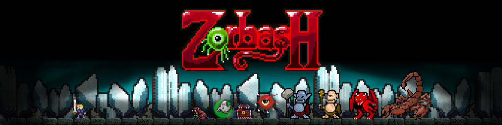
</p>

Welcome to the lair of the dread tentacleye, Zorbash. Collect the crystals of Zorb and confront Zorbash to win.

Itch.io [found here](https://goblinhackgmailcom.itch.io/zorbash)

Comments and suggestions welcome.

Pixel art and ascii mode options
--------------------------------

Press TAB to switch between modes during the game.

<p align="center">

&nbsp; &nbsp; &nbsp; &nbsp;

</p>

<p align="center">

&nbsp; &nbsp; &nbsp; &nbsp;

</p>

<p align="center">

&nbsp; &nbsp; &nbsp; &nbsp;

</p>

<p align="center">

&nbsp; &nbsp; &nbsp; &nbsp;

</p>

<p align="center">

&nbsp; &nbsp; &nbsp; &nbsp;

</p>

<p align="center">

&nbsp; &nbsp; &nbsp; &nbsp;

</p>

<p align="center">
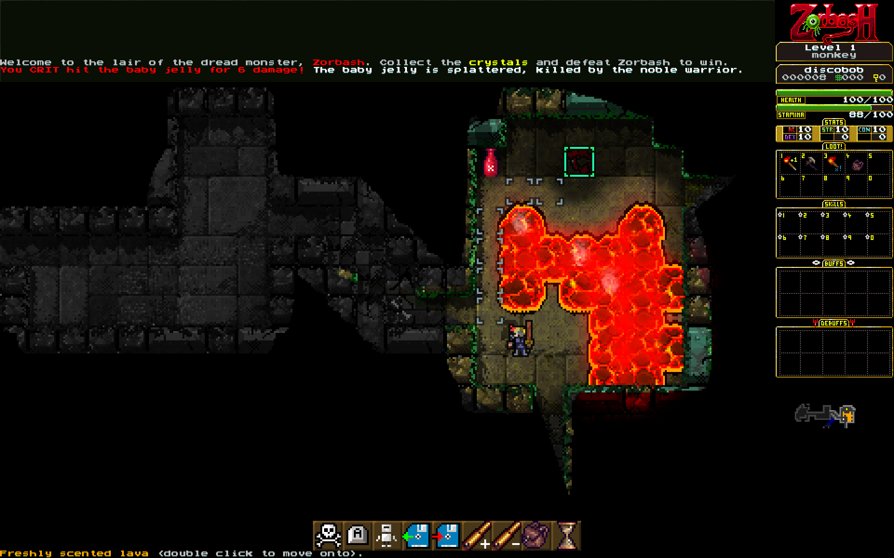
&nbsp; &nbsp; &nbsp; &nbsp;
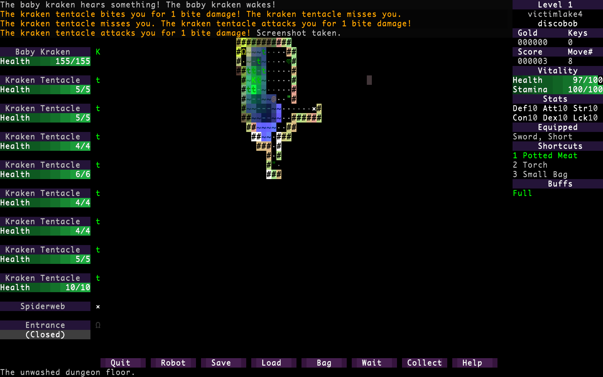
</p>

<p align="center">
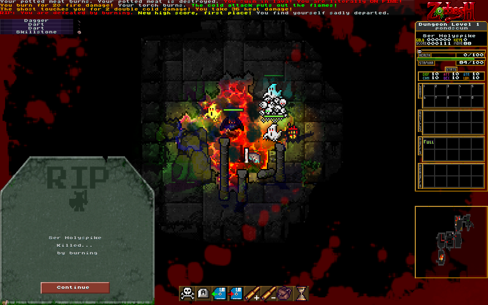
&nbsp; &nbsp; &nbsp; &nbsp;
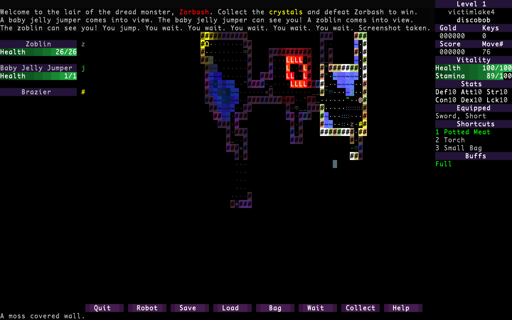
</p>

<p align="center">
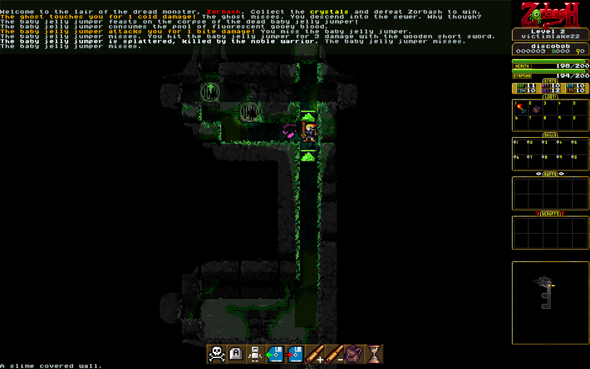
&nbsp; &nbsp; &nbsp; &nbsp;
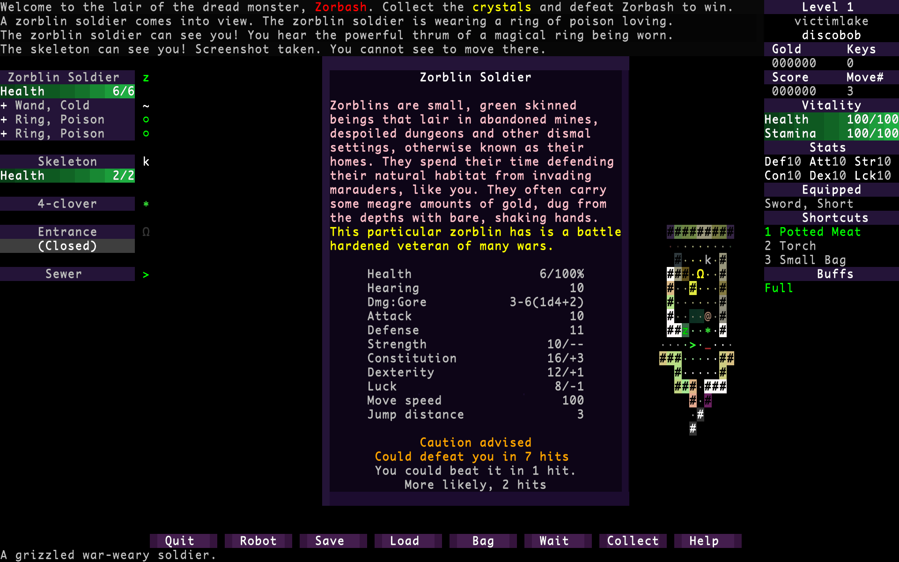
</p>

<p align="center">
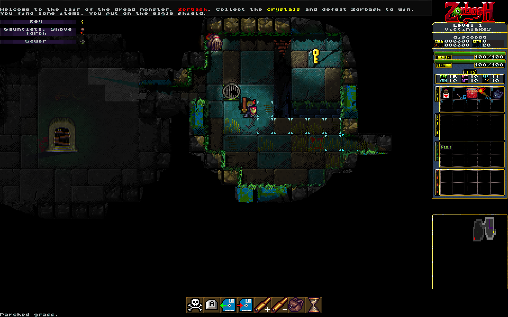
&nbsp; &nbsp; &nbsp; &nbsp;
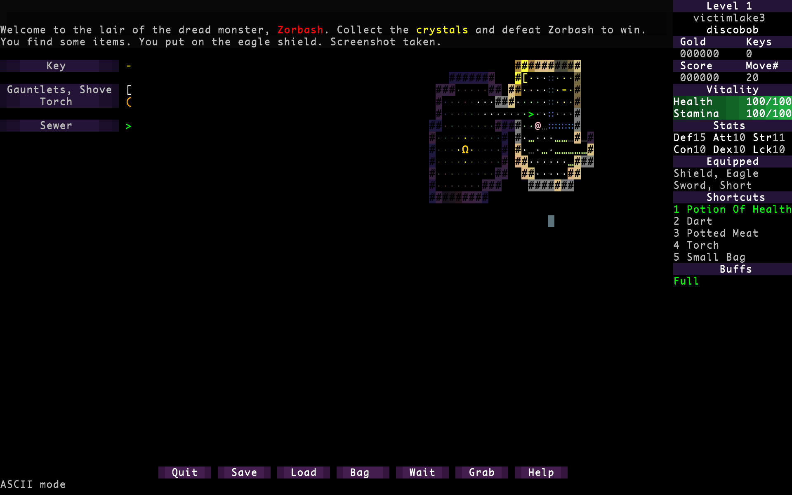
</p>

<p align="center">
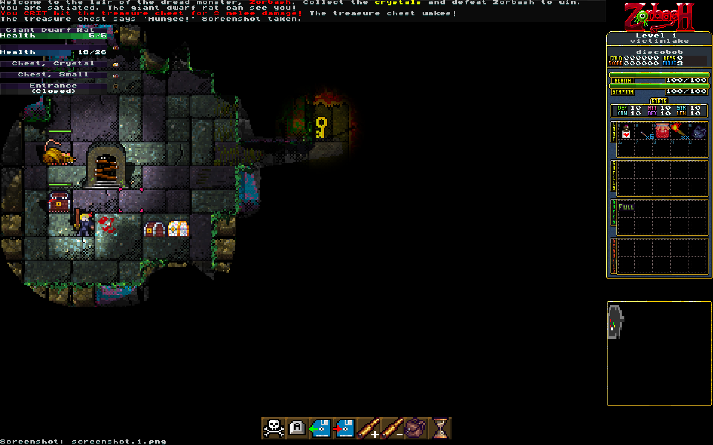
&nbsp; &nbsp; &nbsp; &nbsp;
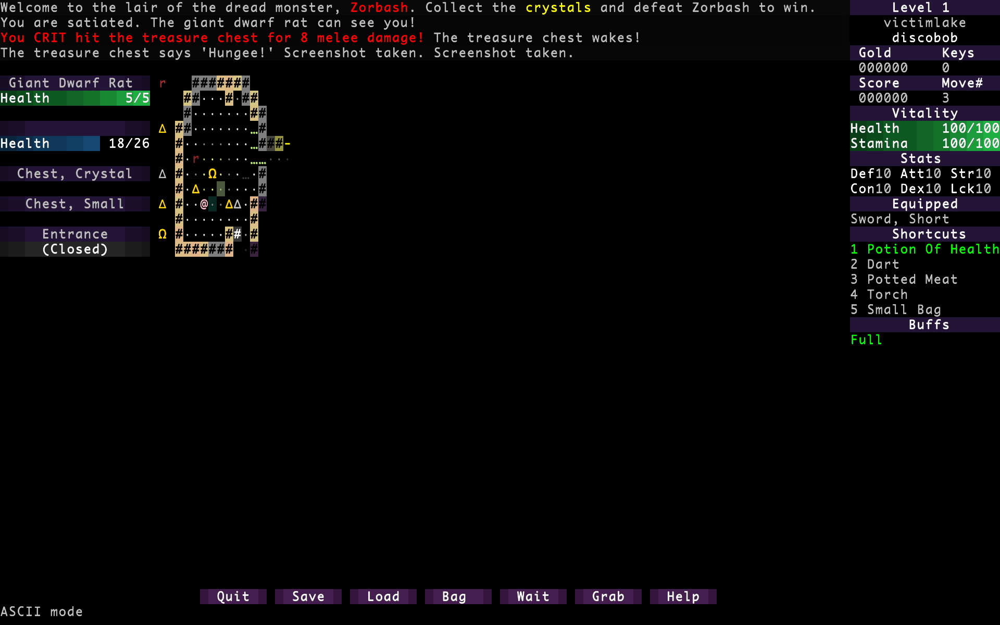
</p>

<p align="center">
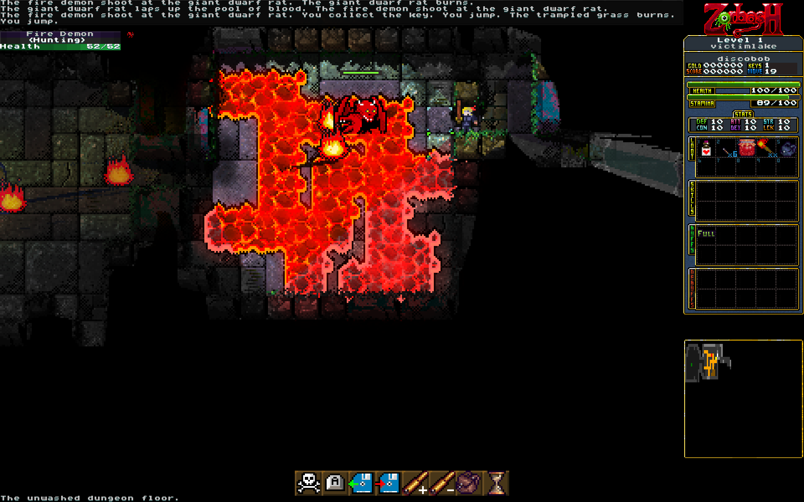
&nbsp; &nbsp; &nbsp; &nbsp;
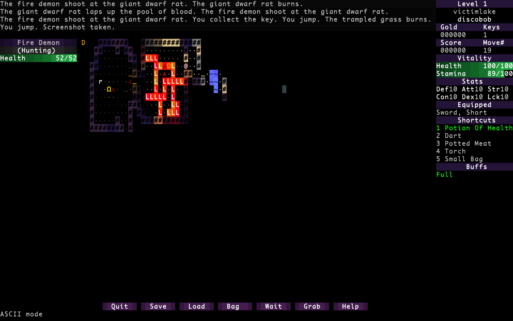
</p>

<p align="center">
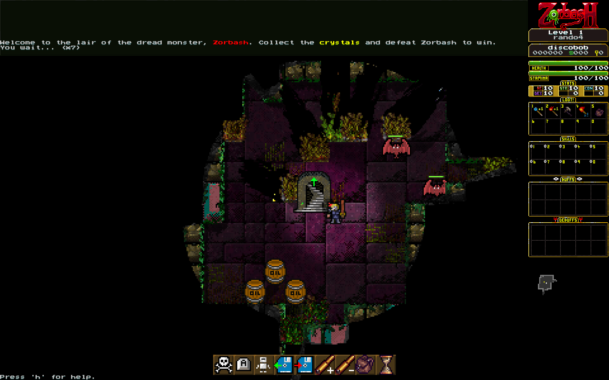
&nbsp; &nbsp; &nbsp; &nbsp;
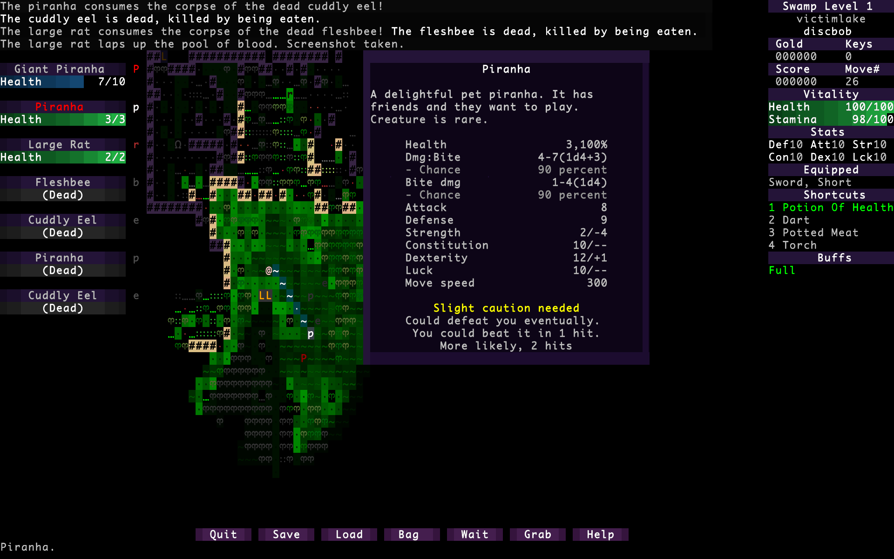
</p>

<p align="center">

&nbsp; &nbsp; &nbsp; &nbsp;
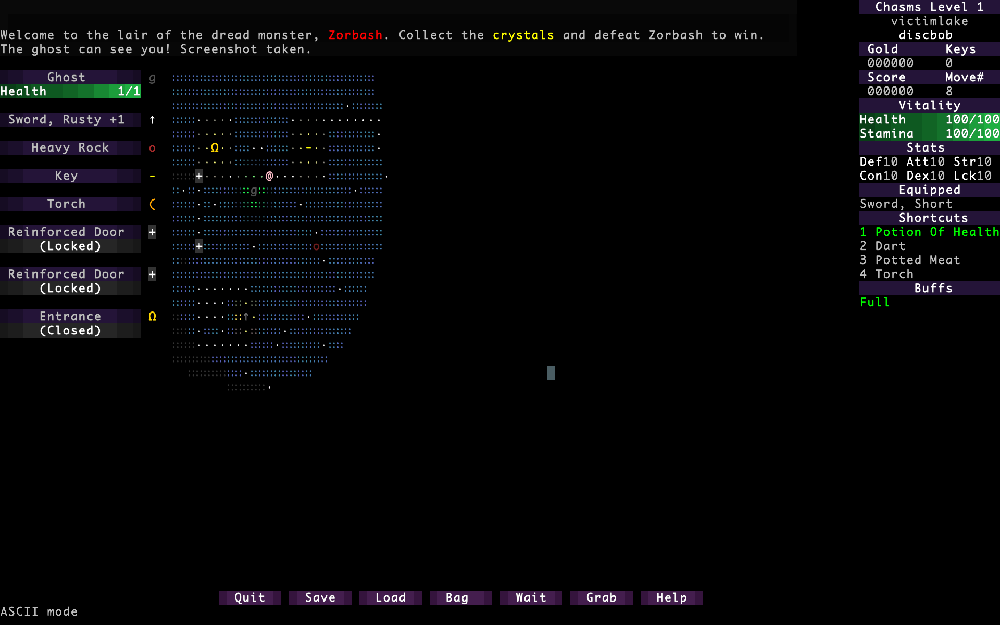
</p>

Content:
- Dungeon, sewer, swamp, ice, lava, chasms and flooded dungeon biomes
- Multiple skill and spell trees
- No end game yet
<!-- begin type marker -->
- 108 x monsters
- 52 x food
- 24 x treasure
- 23 x items
- 18 x spells
- 15 x weapons
- 13 x buffs
- 11 x skills
- 7 x debuffs
- 6 x staffs
- 6 x shield
- 6 x boots
- 5 x rings
- 5 x keys
- 4 x traps
- 4 x gauntlets
- 4 x armor
- 4 x amulets
- 3 x mobs
- 3 x doors
- 3 x cloaks
- 2 x potions
- 1 x player
<!-- end type marker -->

<!-- begin monster type marker -->
| Monster | Danger | Nat Attack | # Attacks | Other damage types |
| :--- | --- | --- | --- | --- |
| Ettin, Two Headed Giant | 382 | 1d10+4 | 2 |  |
| Reaper | 356 | 1d6+6 | 1 |  |
| Flesh Golem | 336 | 2d8+4 | 2 |  |
| Fire Demon | 328 | 1d14+4 | 2 |  Fire:1d6+6 |
| Cthulite | 322 | 1d14+4 | 2 |  Acid:2d6 Poison:2d12 |
| Undead Bear | 320 | 2d8+5 | 2 |  Necrosis:1 |
| Bearowl | 290 | 2d8+5 | 2 |  |
| Baby Kraken | 279 |  | 1 |  Bite:3d8+10 Digest:1d40 Drown:1d20+10 |
| Colossal Scorpion | 255 |  | 1 |  Bite:3d8+10 Digest:1d40 Poison:1d20+10 |
| Yeti | 216 | 1d20+8 | 1 |  |
| Fire Troll | 214 | 1d12+4 | 1 |  |
| Dungeon Cleaner | 197 | 1d20 | 1 |  Digest:1d40 |
| Stone Troll | 193 | 1d12+4 | 1 |  |
| Giant Skeleton | 184 | 1d6 | 1 |  |
| Mummy | 184 | 1d10+10 | 2 |  Stamina:1d10 |
| Cement Man | 178 | 3d8+6 | 1 |  |
| Giant Spider | 139 | 1d8+3 | 1 |  Poison:2d8 |
| Lesser Tentacleye | 136 | 2d6 | 1 |  |
| Bone Spider | 132 | 1d8+3 | 1 |  Poison:2d8 |
| Murder Bunny | 132 | 1d8 | 2 |  Bite:1d6 Claw:1d4 |
| Gargoyle | 128 | 2d6 | 1 |  |
| Hill Ogre | 127 | 1d10+4 | 1 |  |
| Iceman | 125 |  | 1 |  Cold:1d8 |
| Flameskull | 121 | 2d6 | 1 |  |
| Unleashed Gargoyle | 119 | 1d6+2 | 1 |  |
| Portable Hole | 117 |  | 0 |  |
| Mummy Necromancer | 112 | 1d6+10 | 1 |  Necrosis:1 |
| Demon Goat | 103 | 2d6+2 | 1 |  |
| Giant Piranha | 101 | 1d10+3 | 1 |  Bite:1d8 |
| Noble Warrior | 100 | 1d3 | 1 |  |
| Giant Battle Duck | 96 | 1d8+4 | 1 |  Bite:1d10 Claw:1d6 |
| Mimic | 91 | 1d8+4 | 1 |  |
| Treasure Chest | 91 | 1d8+4 | 1 |  |
| Mantisman | 85 | 1d12+8 | 1 |  |
| Zorblin Priest | 84 | 2d6+2 | 1 |  |
| Cuddly Electric Eel | 83 | 1d3+1 | 1 |  Bite:1d4 |
| Dreadfire Snake | 81 | 1d3+1 | 1 |  Poison:1d4 |
| Flux Spider | 77 | 1d3 | 1 |  Necrosis:1 Poison:1d4 |
| Zorblin Pirate | 76 | 1d4+2 | 1 |  |
| Zorblin Leader | 76 | 1d4+2 | 1 |  |
| White Assassin Duck | 75 | 1d6+1 | 1 |  Bite:1d8 Claw:1d6 |
| Gaseous Gloat | 74 | 1d20 | 1 |  Digest:1d40 |
| Gargoyle Baby | 74 | 1d6 | 1 |  |
| Huge Fluffy Bat | 74 | 1d8+2 | 1 |  Bite:1d8 Claw:1d6 Poison:1d4+1 |
| Death Hornet | 72 | 1d4+1 | 1 |  Bite:1d10 Poison:1d10 |
| Dungeon Belcher | 72 | 1d20 | 1 |  Digest:1d10 |
| Teletoad | 71 | 1d3+1 | 1 |  Poison:1d10 |
| Zorblin Soldier | 70 | 1d4+2 | 1 |  |
| Deathstalker Scorpion | 66 | 1d6+1 | 1 |  Poison:1d30 |
| Lesser Zorblin | 64 | 1d4+2 | 1 |  |
| Zorblin Wizard | 64 | 1d4+2 | 1 |  |
| Dogman | 64 | 1d4+1 | 1 |  |
| Molekin | 63 | 1d4+2 | 1 |  |
| Pyrolizard | 63 | 1d6+1 | 1 |  |
| Gnome Knight | 62 | 1d6+1 | 1 |  |
| Zorblin Eldster | 62 | 1d4+2 | 1 |  |
| Zorblin Necromancer | 62 | 1d4+2 | 1 |  |
| Rock Gnome | 60 | 1d6+1 | 1 |  |
| Zoblin | 60 | 1d6 | 1 |  |
| Carcass Creeper | 60 | 1d6+2 | 1 |  Bite:1d8 Claw:1d6 Poison:1d10 |
| Piranha | 59 | 1d4+3 | 1 |  Bite:1d4 |
| Gnorf | 58 | 1d4+1 | 1 |  |
| Brown Extrovert Spider | 58 | 1d3 | 1 |  Necrosis:1 Poison:1d4 |
| Battle Goat | 56 | 1d6+2 | 1 |  |
| Flaming Skeleton | 56 | 1d4 | 1 |  |
| Slime Jumper | 52 | 2d6+2 | 1 |  Acid:1d6 |
| Burning Skeleton | 52 | 1d3 | 1 |  |
| Gnome Thief | 52 | 1d2+1 | 1 |  |
| Onyx Widow | 51 | 1d3 | 1 |  Poison:1d4 |
| Kraken Tentacle | 50 | 1d3+1 | 1 |  Poison:1d8+1 |
| Meatfairy | 50 | 1d3+1 | 1 |  Bite:1d4 Claw:1d2 |
| Moresquito | 48 | 1d3+1 | 1 |  Bite:1d4 Claw:1d3 Poison:1d4 Stamina:1d4 |
| Blinkcat | 47 | 1d3+1 | 1 |  |
| Narhornet | 46 | 1d6+1 | 1 |  Bite:1d4 Poison:1d8 |
| Scorpion | 45 | 1d3+1 | 1 |  Poison:1d12 |
| Giant Rat | 44 | 1d6+2 | 1 |  |
| Centipede | 43 | 1d4+2 | 1 |  Bite:1d8 Claw:1d4 Poison:1d4 |
| Asp | 43 | 1d3+1 | 1 |  Poison:1d3+1 |
| Cuddly Eel | 43 | 1d3+1 | 1 |  Bite:1d4 |
| Para Spider | 39 | 1d3 | 1 |  Poison:1d4 |
| Fluffy Bat Minion | 39 | 1 | 1 |  Bite:1d3 Claw:1d2 |
| Large Rat | 38 | 1d4+2 | 1 |  |
| Jackalope | 38 | 1d6 | 1 |  |
| Orb Of Fire | 38 |  | 0 |  |
| Fluffy Bat | 37 | 1 | 1 |  Bite:1d3 Claw:1d2 |
| Orb Of Energy | 37 |  | 0 |  |
| Giant Dungeon Duck | 37 | 1d3+1 | 1 |  Bite:1d4 Claw:1d3 |
| Ghost | 35 |  | 1 |  Cold:1 |
| Possessed Ghost | 35 |  | 1 |  Cold:1 |
| Clingy Leech | 35 | 1d3+1 | 1 |  Bite:1d4 Stamina:1d4 |
| Jade Viper | 35 | 1d3+1 | 1 |  Poison:1d2 |
| Fleshbee | 32 | 1d3+1 | 1 |  Bite:1d4 Claw:1d3 |
| Skeleton | 32 | 1d3 | 1 |  |
| Sewer Crab | 31 | 1d3+1 | 1 |  |
| Skeleton | 30 | 1d3 | 1 |  |
| Possessed Skeleton | 30 | 1d3 | 1 |  |
| Baby Slime Jumper | 27 | 1 | 1 |  Acid:1d3 |
| Goldfish | 27 | 1 | 1 |  Bite:1d1+1 |
| Sheep | 26 | 1d3+2 | 1 |  |
| Vampire Rose | 25 | 1d6 | 1 |  Digest:1d5 |
| Bloated Bloodbug | 24 | 1d2+1 | 1 |  Bite:1d2 Stamina:1d1 |
| Lava Ant | 22 | 1d3+1 | 1 |  Bite:1d4 Claw:1d3 Fire:1d3+1 |
<!-- end monster type marker -->

Pixelart Screenshots
--------------------


Ascii Screenshots
-----------------


How to build
------------

Linux
=====
- Tested on Ubuntu 22.10
- Tested on Fedora 37
<pre>
    sh ./RUNME
</pre>

Windows
=======
- Tested on Windows 10
- Please install msys2 first via https://www.msys2.org/
<pre>
    sh ./RUNME
</pre>

Macos
=====
- Install Mac Ports/Homebrew first.
- Does not work with anaconda (help wanted as I do not use anaconda):
<pre>
    sh ./RUNME
</pre>

Docker
======
- Docker (experimental, it builds but cannot find a video display):
<pre>
    sh ./RUNME.docker.ubuntu
    sh ./RUNME.docker.fedora
    sh ./RUNME.docker.debian
</pre>

Hardware Specs
--------------
The game should run fine on low end PCs, a half decent graphics card and
likely > 4g of RAM. If graphics is a limitation, you could run it in ascii
mode. I'd be interested in knowing of any low end specs that people get
this PC working on.

Dependancies
------------
OpenGL, SDL2 and Python3 (tested up to 3.11) is needed.

<!-- In days of old, The Zorbashian Empire discovered the Earth and they wrought much rage -->
<!-- upon her verdant soils. Their wrath was mighty and left the world scarred and in darkness. -->
<!--  -->
<!-- Those that remain, scavenge amongst the ruins of once great cities. Religious zealotry -->
<!-- has taken hold and all technology is viewed as demonic magic and forbidden. To be found -->
<!-- with Zorbashian tech is a death sentence. -->
<!--  -->
<!-- The planet is now a hellscape. Lava flows freely from the gushing wounds in the soil -->
<!-- and deserts grow larger every year. The animals have mutated into fearsome beasts and -->
<!-- the only safety is to be found in the undercities. -->
<!--  -->
<!-- Your task, nobel one, is only to survive, for in surviving we continue to resist. -->
<!-- If you are able to strike a blow against the Zorbashian demons then seek out their -->
<!-- many underground bases. It is from here they spawn from their far off realm. But -->
<!-- beware, they have many dread beasts guarding their bases. -->
<!--  -->
<!-- Legend says that there is a master base somewhere, where the Emperor Zorbash resides. -->
<!-- Whether this is true or not, cannot be said but to strike at the heart of their rule -->
<!-- may be enough to drive the Zorbashians out. And then we can be free again. -->
<!--  -->
<!--                       Hark! Hear now a tale untold -->
<!--                       since ancient times of yore -->
<!--                       of Zorbash, forgotten beast of old,  -->
<!--                       who dwelled deep near the Earth’s core -->
<!--                        -->
<!--                       ‘Twas from the Abyss he first arose, -->
<!--                       Forged treasures gold and gleaming.  -->
<!--                       A deadly lure to tempt all those -->
<!--                       Prone to greed and scheming -->
<!--                        -->
<!--                       Many fell before his throne,  -->
<!--                       Heroes fell asunder. -->
<!--                       His lightning gaze turned flesh to bone -->
<!--                       His roar was loud as thunder. -->
<!--                        -->
<!--                       Quenchless, thirsting, dripping gore -->
<!--                       His thousand eyes unmatched -->
<!--                       Until one tenacious band of four -->
<!--                       From him vict’ry snatched.  -->
<!--                        -->
<!--                       Although, ‘twas not an easy fight - -->
<!--                       A sacrifice was made. -->
<!--                       A volunteer, their faithful knight, -->
<!--                       Made sure the price was paid.  -->
<!--                        -->
<!--                       As godlings, the remaining three -->
<!--                       rose with fame and glory -->
<!--                       But that’s not yet the finale -->
<!--                       Of Zorbanadu’s dark story. -->
<!--                        -->
<!--                       For in the depths of Zorbash’s den,  -->
<!--                       A necromancer schemed. -->
<!--                       She planned to raise the beast again, -->
<!--                       And rule as his Dark Queen. -->
<!--                        -->
<!--                       So now Zorbash has come to life -  -->
<!--                       (Though ‘tis more like life’s dark shadow) -->
<!--                       With his fiersome undead wife -->
<!--                       Can you save us all, dear hero?  -->
<!--                        -->
<!--``` -->
<!--                       Secret Verses:                                         -->
<!--                       Twas not an easy fight, it’s true                      -->
<!--                       But not in the way you think.                          -->
<!--                       Our swords cut deep, drew blood_like goo               -->
<!--                       We fought in perfect sync.                             -->
<!--                                                                              -->
<!--                       But as we slashed, great Zorbash did                   -->
<!--                       Let loose an awful cry                                 -->
<!--                       For though blood streamed from each eyelid,            -->
<!--                       He could not seem to die.                              -->
<!--                                                                              -->
<!--                       We fought for days; the beast did roar                 -->
<!--                       And cry all the more miserably                         -->
<!--                       I found myself filled more and more                    -->
<!--                       with a surprising sympathy.                            -->
<!--                                                                              -->
<!--                       In my own house, I had much gold.                      -->
<!--                       A stash I’d saved away.                                -->
<!--                       How would I feel if someone strolled                   -->
<!--                       Into my house one day?                                 -->
<!--                                                                              -->
<!--                       ‘Twas after all, his residence                         -->
<!--                       We’d strolled into so boldly.                          -->
<!--                       He’d every right, after our offense,                   -->
<!--                       To try and kill us slowly                              -->
<!--                                                                              -->
<!--                       I shared my doubts with my dear friends,               -->
<!--                       And received an unhappy surprise                       -->
<!--                       “Betrayal!” they said. “Well, that debate’s at an end. -->
<!--                       You should be the one that dies!”                      -->
<!--                                                                              -->
<!--                       As it turns out, they’d already decided                -->
<!--                       To resort to the darkest extremes.                     -->
<!--                       My weakness, my pity had provided                      -->
<!--                       An excuse for our glorious team.                       -->

Graphics
--------
- Various items and monsters by Oryx, [found here](https://www.oryxdesignlab.com/)
<!-- Oryx: Order Number: #102084 (placed on January 16, 2016 03:14PM EST) -->
- Various items and food by Henry Software, [found here](https://henrysoftware.itch.io)
<!-- purchased on itch.io -->
- Various monsters by DeepDiveGameStudio, [found here](https://deepdivegamestudio.itch.io/)
- Rocks by Pixel Overlord, [found here](https://pixeloverload.itch.io/48x-rock-tile-maps)
<!-- purchased on itch.io -->

Music
-----
- Main music by the amazing Markus Heichelbech (deceased senior technician): [found here](http://nosoapradio.us)
<!-- and https://drive.google.com/drive/folders/0B_fD62tSeGaVRlBaZWJwS29JSnM -->

Sound effects
-------------
- 8 bit sounds by Oryx [found here](https://www.oryxdesignlab.com/)
- Bone by ChrisReierson [found here](https://freesound.org/people/ChrisReierson/)
- Coin drop by Flem0527 [found here](https://freesound.org/people/Flem0527/sounds/630018/)
- Door by danielvj [found here](https://freesound.org/people/danielvj/)
- Door by TiesWijnen [found here](https://freesound.org/people/TiesWijnen/)
- Door souds by Patchytherat [found here](https://freesound.org/people/patchytherat/sounds/530987/)
- Falling sound [found here](https://freesound.org/people/nomiqbomi/sounds/578808/)
- Footstep by Rico Casazza [found here](https://freesound.org/people/Rico_Casazza/)
- Gold coins by Herkules92 [found here](https://freesound.org/people/Herkules92/)
- Grunt squeak by vmgraw [found here](https://freesound.org/people/vmgraw/)
- Impact by Adam N [found here](https://freesound.org/people/egomassive/)
- Impact by Deathscyp [found here](https://freesound.org/people/Deathscyp/)
- Impact by Dersuperanton [found here](https://freesound.org/people/dersuperanton/)
- Impact by RobinHood76 [found here](https://freesound.org/people/Robinhood76/)
- Kraken sound [found here](https://freesound.org/people/cylon8472/)
- Monster death by Michel88 [found here](https://freesound.org/people/Michel88/)
- Monster epic death [found here](https://freesound.org/people/Syna-Max/sounds/56304/)
- Monster sound [found here](https://freesound.org/people/NicknameLarry/)
- Mushrooms [found here](https://ssugmi.itch.io/fantasy-mushroom-pack)
- Power up by GameAudio [found here](https://freesound.org/people/GameAudio/)
- Pressure plate by Proolsen [found here](https://freesound.org/people/proolsen/sounds/466272/)
- Rat growl by qubodup [found here](https://freesound.org/people/qubodup/)
- Rat hiss by qubodup [found here](https://freesound.org/people/qubodup/)
- Rat squeak by tim.kahn [found here](https://freesound.org/people/tim.kahn/)
- Sheep sounds by n_audioman [found here](https://freesound.org/people/n_audioman/)
- Skill learn by Mrthenoronha [found here](https://freesound.org/people/Mrthenoronha/)
- Slime by Konstati [found here](https://freesound.org/people/konstati/)
- Slime by wubitog [found here](https://freesound.org/people/wubitog/)
- Slime by Zuzek06 [found here](https://freesound.org/people/Zuzek06/)
- Sword by Danjocross [found here](https://freesound.org/people/Danjocross/)
- Sword by XxChr0nosxX [found here](https://freesound.org/people/XxChr0nosxX/)
- Sword sounds by Q.K [found here](https://freesound.org/people/Q.K./)
- Sword sounds by qubodup [found here](https://freesound.org/people/qubodup/sounds/442769/)
- Sword sounds by SlavicMagic [found here](https://freesound.org/people/SlavicMagic/sounds/446015/)
- Water splash by launemax [found here](https://freesound.org/people/launemax/)
- Wood break by Deathscyp [found here](https://freesound.org/people/Deathscyp/)
